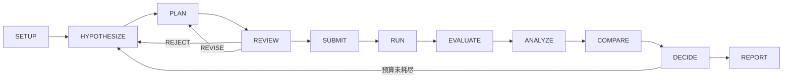

# TopOptPilot V6.1.0 架构文档

> **V6.1.0 当前实现**：主链为 **Desktop (Tauri 2) → FastAPI sidecar → ResearchService →
> Subagent 编排（Guide / Hypothesis / Planner / Executor / Reviewer / Report Writer）
> → Pi Bridge (JSON-RPC) → ToolGateway (16 tools) → Safety Policy →
> MATLAB MCP（F0–F3 全保真）→ Evaluator → L0–L3 Memory + 离线知识库**。
>
> V6.1.0 新增能力：
> - **Windows Credential Manager 凭据管理** — Qwen API Key 可写入 Windows 凭据管理器（win32cred），不再只依赖环境变量
> - **AI 引导的研究设置向导（Guide）** — 自然语言研究目标 → 结构化研究契约
> - **MATLAB 全保真链** — F0/F1 = 2D、F2/F3 = 3D，全部经 MATLAB MCP；**Python 求解器退出正式求解路径**
> - **子代理（Subagent）架构** — GUIDE / HYPOTHESIS / EXPERIMENT_PLANNER / EXPERIMENT_EXECUTOR / INDEPENDENT_REVIEWER / REPORT_WRITER + RESEARCH_LEAD 协调
> - **离线知识库** — SQLite FTS5 全文检索 + 模板案例 + Desktop Knowledge Center
> - **模板化研究报告** — 逐轮 Markdown（`round-XX.md`）+ 终版 Markdown/PDF
> - **新 API 端点 / WebSocket 事件 / Pydantic 数据类型**（见 §3.4–3.6）
> - **11 态研究状态机** (SETUP → … → REPORT) 与仅 **F3 人工审批** 的执行边界

Streamlit Workspace 保留为开发兼容层，旧 CLI 驾驶舱 `frontend/cockpit.py` 仅兼容保留。

---

## 1. 总体架构

### V6.1 五层分层

```
┌─────────────────────────────────────────────────────────────────────┐
│                     用户与前端层                                      │
│  Desktop (Tauri 2 + React)   Streamlit (legacy)   FastAPI (API)    │
│  ┌─ SettingsWorkspace ───────────────────────────────────────────┐ │
│  │  通用 · Agent/模型(含 Windows 凭据) · MATLAB/计算               │ │
│  │  · 新研究默认值 · 数据/诊断                                    │ │
│  ├─ ResearchSetup (AI 引导 Setup 向导, V6.1) ────────────────────┤ │
│  │  · KnowledgeCenter(离线知识库, V6.1) · ExperimentCanvas        │ │
│  │  · HealthBar (Sidecar/MATLAB 健康状态)                         │ │
│  └───────────────────────────────────────────────────────────────┘ │
├─────────────────────────────────────────────────────────────────────┤
│                     业务与服务层                                      │
│  ResearchService → Subagent 编排(RESEARCH_LEAD) → ResearchOrchestrator │
│  → Pi Bridge (JSON-RPC) → ToolGateway (16 tools 沙箱, V6.1 扩容)     │
│  → Reviewer bounded workflow（REVIEW_VERDICT 裁决门）                │
│  AppSettings 持久化（locale / agent / compute / new_research / data）│
├─────────────────────────────────────────────────────────────────────┤
│                     策略与裁决层                                      │
│  SafetyGuard · IntentCompiler · ActionPolicy · ApprovalPolicy       │
│  （F0–F2 自动执行；仅 F3 人工审批）                                  │
│  DOE Templates · Evaluator · FailureDetector · FidelityManager      │
│  （F0–F3 全 MATLAB MCP）                                            │
├─────────────────────────────────────────────────────────────────────┤
│                     方法与求解层                                      │
│  MATLAB MCP 全保真 (F0/F1=2D, F2/F3=3D, 官方 MCP server)            │
│  MATLAB 参考实现 (.m, 求解器模块/)  ·  Python FEM（V6.1 退出正式路径）│
│  MATLAB 路径安全校验（reject paths outside research_root）          │
├─────────────────────────────────────────────────────────────────────┤
│                     知识与持久层                                      │
│  ResearchMemory (L0–L3) · ResearchStateStore (SQLite, 11 张业务表)  │
│  KnowledgeBase (SQLite FTS5 + 模板案例, V6.1)                       │
│  TemplateReports (逐轮/终版 MD+PDF, V6.1) · Security (Credential     │
│  Manager, V6.1) · Cases · Release Audit · Replay · app_settings 表  │
└─────────────────────────────────────────────────────────────────────┘
```

### 核心设计原则

1. **大模型不代替有限元求解器** — Qwen 负责科研推理与子代理编排；MATLAB MCP 负责确定性数值计算（F0–F3 全保真）
2. **论文方法工程化** — 论文转化为带证据、适用条件、风险说明和验证状态的 MATLAB 插件
3. **客观裁决** — Evaluator 用残差、柔度、灰度比例、连通性等指标裁决方案，子代理不能自评（独立 Reviewer 交叉评审）
4. **全链路 MATLAB 保真** — F0/F1=2D、F2/F3=3D 全部只接受真实 MATLAB MCP 结果；失败记为 `MATLAB_INFRASTRUCTURE`，**禁止** Python 伪回退；Python FEM 已于 V6.1 退出正式求解路径，仅作开发/基准参考
5. **设置与数据安全** — 应用设置（AppSettings）持久化到 SQLite；Qwen API Key 写入 **Windows Credential Manager**（win32cred）或回退读取 `DASHSCOPE_API_KEY` 环境变量，**永不**进入 SQLite/报告/日志；MATLAB 连接器校验路径在 research_root 内
6. **分层人工边界** — F0–F2 经 Policy/Safety/Budget 自动执行；**仅 F3 需要人工审批**（COPILOT 模式 / HIGH 风险例外）

---

## 2. AI Scientist 架构

V5 起维护两套 Agent 体系，V6.1 在 Pi 内引入第三套（子代理）体系，三层分工明确：

### 2.1 `agent/` — 6 角色研究级编排器（V4 遗留，兼容保留）

`agent/roles/` 包含 6 个完整角色类，每个角色有 Pydantic 数据模型 + JSON Schema 输出约束：

| 角色 | 文件 | 职责 |
|------|------|------|
| ResearchLead | `research_lead.py` | 任务分解、进度监控、终止决策 |
| EvidenceAgent | `evidence_agent.py` | 文献挖掘、方法抽取、知识缺口识别 |
| HypothesisAgent | `hypothesis_agent.py` | 生成 3–5 个可证伪候选假设 |
| ReviewAgent | `review_agent.py` | 4 维评审（新颖/自洽/可证伪/成本）+ 反例生成 |
| ExperimentAgent | `experiment_agent.py` | 设计实验矩阵、验证插件组合、生成任务 JSON |
| AuditAgent | `audit_agent.py` | 结果判定（SUPPORTED/PARTIAL/NOT/INSUFFICIENT）+ 失败诊断 |

配套：
- `agent/state_machine.py` — 10 状态机（INIT → CONCLUSION/FAILED），含 4 类终止条件
- `agent/orchestrator.py` — `TopOptPilotOrchestrator.run()` 8 phase 迭代循环
- `agent/llm/` — `PiAgentClient` (Qwen) + `MessageBuilder` + `ResponseParser`
- `agent/prompts/system_prompts.py` — 6 角色专用 system prompt
- `agent/tools/` — paper_reader / reference_checker / topopt_solver

**入口**：`python -m agent.orchestrator --task <task.json>`（独立运行，不依赖 topoptpilot/）

### 2.2 `topoptpilot/` — 生产级 Pi RPC 服务（V5 模块层）

`topoptpilot/agent/` 用 3 个模块替代 6 角色，通过 Pi Agent 工具沙箱实现科研推理（V6.1 起逐步被 §2.3 子代理替代）：

| 模块 | 文件 | 职责 |
|------|------|------|
| Planner | `agent/planner.py` | 构建初始计划 (`build_initial_plan`) |
| Analyst | `agent/analyst.py` | 构建分析 (`build_analysis`) |
| Feedback | `agent/feedback.py` | 构建反馈 (`build_feedback`) |
| Orchestrator | `orchestrator/research_orchestrator.py` | `ResearchOrchestrator` (inspect_proposal / analyze / initial_plan) |

**核心机制**：Pi Agent 以 JSON-RPC 常驻运行，每个 Research ID 对应一个可恢复 Pi session；
Pi 只接触 16 个科研工具（`tools/research_tools.py` 白名单），参数由 Safety Policy 编译。

**入口**：`python launch.py`（桌面主入口）或 `python launch.py --web`（Streamlit）

### 2.3 V6.1 子代理（Subagent）架构

V6.1 在 Pi 会话内引入 7 角色 Subagent 编排体系（`AgentRole`，`topoptpilot/schemas/models.py`），
每个子代理独立成任务 `SubagentTask`，由 `RESEARCH_LEAD` 调度、`INDEPENDENT_REVIEWER` 交叉裁决：

| AgentRole | 角色 | 职责 |
|-----------|------|------|
| `RESEARCH_LEAD` | 研究主管 | 任务分解、子代理调度（`subagent_dispatch`）、进度监控、终止决策（调度层） |
| `GUIDE` | 研究向导 | 解析自然语言研究目标 → 结构化**研究契约**，驱动 AI 引导的 Research Setup 向导 |
| `HYPOTHESIS` | 假设生成 | 生成 3–5 个可证伪候选假设 + 竞争解释（`ExperimentHypothesis`，发出 `HYPOTHESIS_CREATED` 事件） |
| `EXPERIMENT_PLANNER` | 实验规划 | 把假设编译为 DOE / 受控对照矩阵（`build_plan` → 计划契约） |
| `EXPERIMENT_EXECUTOR` | 实验执行 | 提交 / 轮询实验任务（`experiment_submit` / `experiment_status` / `experiment_result`），收集证据 |
| `INDEPENDENT_REVIEWER` | 独立评审 | 4 维评审（新颖/自洽/可证伪/成本）+ 反例生成，产出 `SubagentVerdict`（`REVIEW_VERDICT` 事件） |
| `REPORT_WRITER` | 报告撰写 | 从权威 Research State 生成模板研究报告（逐轮 MD + 终版 MD/PDF，`REPORT_READY` 事件） |

**任务生命周期**：`SubagentTask` 状态机 `QUEUED → RUNNING → COMPLETED / FAILED / CANCELLED`；
执行节点由 `topoptpilot/agent_runtime/pi_bridge.py` 内联驱动（`SUBAGENT_STARTED` / `SUBAGENT_RESULT` 事件），
预留独立 LLM 会话执行通道。

**独立评审裁决**：`SubagentVerdict = ReviewVerdict ∈ {APPROVE, REVISE, REJECT}`；
REJECT 触发假设修订回路（回 `HYPOTHESIZE`），REVISE 触发计划修订回路（回 `PLAN`）。

### 2.4 三套架构的关系

| 维度 | `agent/` (V4 遗留) | `topoptpilot/` 模块 (V5) | `topoptpilot/` 子代理 (V6.1 主用) |
|------|-------------------|--------------------------|-----------------------------------|
| Agent 数量 | 6 个角色类 | 3 个功能模块 + Pi RPC | 7 角色（RESEARCH_LEAD 调度 6 执行角色） |
| 编排方式 | Python 同步循环 | Pi JSON-RPC 常驻 + 工具沙箱 | Pi JSON-RPC + `SubagentTask` 生命周期 |
| 状态机 | 显式 10 状态 | ResearchService 内事件流 | 11 态（§6.6）驱动的子代理产出 |
| 评审 | ReviewAgent | ReviewerWorkflow | INDEPENDENT_REVIEWER + `SubagentVerdict` |
| 适用场景 | 研究/学术验证 | 过渡期 | 生产/产品部署 |

V6.1 主入口（`ResearchService`）调用 Pi 内的 **子代理** 体系，V5 模块层作为过渡兼容，
**不**调用 `agent/orchestrator.py`。三套体系可独立运行。

---

## 3. Pi RPC 运行时

### 3.1 `topoptpilot/agent_runtime/`

| 文件 | 职责 |
|------|------|
| `pi_bridge.py` | Pi 进程生命周期 + JSON-RPC 通信 + **子代理执行节点**（V6.1：SUBAGENT_STARTED / HYPOTHESIS_CREATED / REVIEW_VERDICT / SUBAGENT_RESULT 事件） |
| `pi_session.py` | Session 注册表；按 Research ID 复用进程 |
| `tool_gateway.py` | 工具沙箱网关；**16 工具白名单**；HTTP sidecar；子代理角色白名单映射 |
| `event_mapper.py` | Pi 事件 → 内部事件流映射 |
| `reviewer.py` | `ReviewerWorkflow` — 4 类触发器（HIGH_FIDELITY_ESCALATION / HYPOTHESIS_REVISION / RESEARCH_CONCLUSION / AMBIGUOUS_FAILURE）+ 子代理裁决集成 |

### 3.2 `.pi/` 扩展与技能

| 路径 | 作用 |
|------|------|
| `.pi/extensions/topopt-tools.ts` | 16 工具 TypeScript 沙箱定义（V6.1 扩容：+5 工具） |
| `.pi/skills/causal-reasoning/` | 因果推理技能 |
| `.pi/skills/experiment-planning/` | 实验规划技能 |
| `.pi/skills/failure-diagnosis/` | 失败诊断技能 |
| `.pi/skills/fidelity-budgeting/` | 保真度预算技能 |
| `.pi/skills/hypothesis-evaluation/` | 假设评价技能 |
| `.pi/skills/research-reporting/` | 研究报告技能 |
| `.pi/settings.json` | Pi 运行时配置 |
| `.pi/models.example.json` | 模型配置示例 |

### 3.3 16 科研工具（`topoptpilot/tools/research_tools.py`）

V6.1 白名单由 11 个扩容至 **16 个**（新增项以 ★ 标注）：

`research_get_context` · `research_query_history` · `research_get_budget` ·
`policy_compile_intent` · `experiment_preview` · `experiment_submit` ·
`experiment_status` · `experiment_result` · `experiment_compare` ·
`research_get_pareto` · `failure_get_evidence` ·
★`knowledge_search` · ★`knowledge_get` · ★`solver_get_capabilities` ·
★`subagent_dispatch` · ★`subagent_status`

| 名称 | 用途 |
|------|------|
| `knowledge_search` ★ | 离线知识库 FTS5 全文检索（触发 `KNOWLEDGE_REFERENCED` 事件） |
| `knowledge_get` ★ | 按 document_id 获取知识文档详情 |
| `solver_get_capabilities` ★ | 查询 MATLAB MCP 求解器能力（保真度 × 求解变体，`SOLVER_CAPABILITY` 事件） |
| `subagent_dispatch` ★ | 派发子代理任务（role + objective → `SubagentTask`） |
| `subagent_status` ★ | 查询子代理任务状态 / 结果 |

### 3.4 V6.1 新增 API 端点（`topoptpilot/api/fastapi_app.py`）

| Method | Path | 作用 |
|--------|------|------|
| `GET` | `/api/knowledge/search` | 知识库全文检索（q / locale / category / limit）→ items + categories |
| `GET` | `/api/knowledge/{document_id}` | 知识文档详情（双语渲染） |
| `GET` | `/api/solvers/capabilities` | MATLAB MCP 求解能力矩阵（F0–F3 × SolverVariant） |
| `GET` | `/api/research/{research_id}/agent-tasks` | 列出该研究全部子代理任务（含 SUBAGENT_* 事件） |
| `POST` | `/api/research/{research_id}/guide` | Guide 子代理把自然语言研究目标转译为研究契约并落库 |
| `POST` | `/api/guide` | 引导文本解析/预览（不落库，供 Setup 向导即时反馈） |
| `POST/DELETE` | `/api/settings/agent-key` | 写入 / 删除 Windows Credential Manager 中的 Qwen API Key |
| `POST` | `/api/research/{research_id}/compare` | 受控对照比较（`ControlledComparison`） |

配套新增：`POST /api/solvers/geometry-preview`（几何掩膜预览，V6.1）、`POST /api/research/{research_id}/autonomous`、`POST /api/research/{research_id}/stream-ticket`、
`GET/POST /api/report/{research_id}[/pdf]`（模板报告，见 §9）。

### 3.5 V6.1 新增 WebSocket 事件

| Event | 触发 |
|-------|------|
| `SUBAGENT_STARTED` | 子代理任务开始 |
| `SUBAGENT_RESULT` | 子代理任务产出结果 |
| `HYPOTHESIS_CREATED` | Hypothesis 子代理生成候选假设 |
| `REVIEW_VERDICT` | INDEPENDENT_REVIEWER 产出 APPROVE/REVISE/REJECT |
| `KNOWLEDGE_REFERENCED` | 检索/引用离线知识文档或模板案例 |
| `SOLVER_CAPABILITY` | MATLAB MCP 上报求解能力 |
| `COMPARISON_RESULT` | 受控对照比较完成 |
| `REPORT_READY` | REPORT_WRITER 生成轮次/终版报告 |
| `AGENT_TOOL_CALL` | 子代理调用白名单工具记录 |

### 3.6 V6.1 新增数据类型（`topoptpilot/schemas/models.py`）

| 类型 | 关键字段 |
|------|---------|
| `AgentRole` | RESEARCH_LEAD / GUIDE / HYPOTHESIS / EXPERIMENT_PLANNER / EXPERIMENT_EXECUTOR / INDEPENDENT_REVIEWER / REPORT_WRITER |
| `SubagentTask` | id / research_id / role / objective / status / evidence_ids / proposal_id |
| `SubagentVerdict`（=`ReviewVerdict`） | APPROVE / REVISE / REJECT |
| `KnowledgeDocument` | id / category / title_zh/en / body_zh/en / tags / source |
| `KnowledgeCitation` | document_id / quote / score（检索引用溯源） |
| `SolverCapability` | fidelity → {matrix_size, variants, availability, has_matlab} |
| `SolverVariant` | reference_cpu / optimized_cpu / parallel_cpu / mex / gpu |
| `ExperimentHypothesis` | id / research_id / round_number / statement / competing / evidence_ids / status |
| `ControlledComparison` | experiment_ids(≥2) / parameter_differences / controlled / deterministic_delta |
| `ArtifactLineage` | id / research_id / experiment_id / artifact_type / path / sha256 / parents |
| `SubagentDispatchRequest` | role + objective（Pi 工具入参） |
| `GuideRequest` | text / locale（Guide 子代理与 Setup 向导入参） |

对应 SQLite 新增表：`subagent_tasks` · `hypotheses` · `artifact_lineage` · `knowledge_documents`（+ `knowledge_fts` 虚拟表）。

---

## 4. 求解器层

### 4.1 MATLAB 全保真链（V6.1 正式求解路径）

V6.1 起**全部保真度等级（F0–F3）均走 MATLAB MCP**，Python FEM 退出正式求解路径（仅开发/基准对比）：

| 保真度 | 维度 | 经 MATLAB MCP | 人工审批 |
|--------|------|---------------|----------|
| F0 | 2D 粗网格 | 是（`topopt_main.m`） | 否（自动） |
| F1 | 2D 细网格 | 是（`topopt_main.m`） | 否（自动） |
| F2 | 3D 细网格 | 是（`topopt3d_main.m`） | 否（自动） |
| F3 | 3D 高保真 | 是（`topopt3d_main.m`） | **是（唯一强制审批点）** |

失败一律记为 `MATLAB_INFRASTRUCTURE`，**禁止**任何 Python 伪回退（`matlab3d_adapter.py` 仅做已验证回放）。

### 4.2 `solver/` — Python FEM（V6.1 退出正式路径）

| 文件 | 大小 | 职责 |
|------|------|------|
| `topopt_engine.py` | 9.0 KB | 主优化循环统一入口 `run_topopt()` |
| `fe_solver.py` | 10.4 KB | Quad4 2D FEM + SIMP + 5 种边界 + scipy 稀疏直解 |
| `oc_solver.py` | 7.7 KB | OC 最优性准则 + Lagrange 二分 |
| `filters.py` | 4.9 KB | 灵敏度/密度滤波 + Heaviside 投影 + 伴随 |
| `continuation.py` | 5.3 KB | 4 种控制器（fixed/periodic/gray/joint feedback）+ penal 延续 |
| `params.py` | 8.2 KB | 任务规范化（ExperimentTask / JSON → `task_spec`） |
| `result_schema.py` | 4.4 KB | ExperimentResult 契约 |
| `topopt3d.py` | 9.8 KB | Hex8 3D FEM + Gauss 2×2×2 |
| `matlab_backend.py` | 11.3 KB | MATLAB Engine 双后端（`matlabengine` pip） |

> **V6.1 状态变更**：`solver/`（Python FEM）不再是产品正式求解路径，保留用于开发自检与
> baseline 对比；与 MATLAB 地面真值逐点核对（最大偏差 ≤1.2%）仅用于回归验证。

### 4.3 `求解器模块/` — MATLAB 参考实现（权威产品资源）

| 路径 | 入口 | V6.1 用途 |
|------|------|-----------|
| `求解器模块/2D/TopOpt_integrated/TopOpt_integrated/topopt_main.m` | 2D SIMP 主入口 | F0/F1 求解（经 MATLAB MCP） |
| `求解器模块/TopOpt-3D/TopOpt-3D/topopt3d_main.m` | 3D SIMP 主入口 | F2/F3 求解（经 MATLAB MCP） |

打包时随 `scripts/build_desktop.ps1` 一同暂存到 `desktop/src-tauri/resources/`。

### 4.4 `mcp/matlab_mcp/` — 官方 MATLAB MCP Server 集成（V6.1 全保真枢纽）

| 文件 | 职责 |
|------|------|
| `matlab_connector.py` | JSON-RPC 2.0 stdio 客户端；自动探测 MATLAB 根目录；**路径安全校验**（拒绝 research_root 外路径） |
| `matlab_mcp_server.py` | `MatlabMcpWorker` 单会话 worker；参数包络校验 |
| `topopt-tools.json` | MCP 工具定义（`topopt_run_task` 单工具） |
| `topopt_run_task.m` | MATLAB 端适配器；路径安全 + 维度分派（2D/3D）+ 结果 JSON 写出 |

**运行时要求**：`vendor/matlab-mcp-server/matlab-mcp-server-windows-x64.exe` (18.3 MB,
BSD-3 MathWorks) + MATLAB R2024a 安装。

### 4.5 `mcp/solver_mcp/` — CUDA MEX（占位）

`solver_mcp_server.py` 与 `mex_handle_manager.py` 均为 docstring-only 占位，
**无实现**。当前求解路径为 **MATLAB MCP 全保真链（F0–F3）**。

---

## 5. 策略与安全（`topoptpilot/policy/`）

| 文件 | 职责 |
|------|------|
| `safety_guard.py` | `evaluate_safety()` — 参数硬约束（volfrac/rmin/beta/penal/max_iter + 允许列表）；LOW/MEDIUM/HIGH 风险 |
| `action_policy.py` | `choose_action()` — 评价结果 → 4 类下一动作 |
| `approval_policy.py` | `requires_human_approval()` — **仅 F3 强制审批**；COPILOT 模式 / HIGH 风险 / 超预算例外 |
| `intent_compiler.py` | `IntentCompiler.compile()` — 7 种科学意图 → 差异化 MATLAB 配置 |
| `doe_templates.py` | 3 个命名竞争解释模板（beta_vs_rmin / beta_vs_penal / projection_vs_controller） |

### 5.1 人工审批边界（V6.1）

```
F0 / F1 / F2  →  ApprovalPolicy + SafetyGuard + Budget 全自动执行，无需人工干预
F3           →  requires_human_approval() == True，APPROVE 前禁止真实 3D 高保真求解
```

仅 `PENDING_HUMAN_APPROVAL` 状态会阻塞流水线；子代理 REVIEW_VERDICT==APPROVE 通过后进入执行。

### 5.2 7 种科学意图

| IntentType | 行为 |
|-----------|------|
| `ESTABLISH_BASELINE` | F0 基线：beta=1.0, rmin=1.5, penal=3.0 |
| `EXPLORE_PARAMETER` | 扫描 factor levels |
| `REDUCE_GRAYNESS` | beta 翻倍 |
| `RESTORE_CONNECTIVITY` | 减半 beta 或 rmin 增 0.5 |
| `TEST_COMPETING_EXPLANATIONS` | 委托 `discriminating_experiments()` 生成受控对照 |
| `UPGRADE_FIDELITY` | 由 FidelityManager 升保真（F0→F1→F2→F3） |
| `VERIFY_CANDIDATE` | 同上，验证候选方案 |

---

## 6. 记忆、知识库与状态机

### 6.1 `topoptpilot/memory/`

| 文件 | 职责 |
|------|------|
| `research_memory.py` | `ResearchMemory.build()` — L0/L1/L2/L3 四层记忆 |
| `research_state.py` | `ResearchStateStore` — SQLite + WAL；11 张业务表 |
| `compressor.py` | `compress_events()` — 历史事件压缩（最近 20 条保留原文） |
| `retriever.py` | `retrieve_events()` — 关键词检索 |

**L0 Artifact References** → 实验产物路径（`ArtifactLineage` 绑定 sha256 血缘）
**L1 Experiment Records** → 完整实验记录
**L2 Scientific Memory** → best_candidate / known_failures / parameter_trends / pareto_candidates
**L3 Research Context** → 高层摘要（给 Agent 用）

### 6.2 SQLite 11 张业务表

V6.0 的 8 张表 + V6.1 新增 3 张（★）：

`research` · `experiments` · `events` · `decisions` · `proposals` · `memory_snapshots` · `agent_sessions` · `app_settings`（单行 JSON，UPSERT）·
★`subagent_tasks`（子代理任务）· ★`hypotheses`（候选假设）· ★`artifact_lineage`（产物血缘）

另有知识库专用表：`knowledge_documents` + FTS5 虚拟表 `knowledge_fts`（见 §6.5）。

`app_settings` 存储 `AppSettings` 模型（locale / ui_density / startup_behavior / agent / compute / new_research / data），
Qwen API Key **不**出现在此表中（见 §6.4.1）。

### 6.3 `topoptpilot/storage/`

运行时数据目录（`.gitignore` 排除）：`research.db` + `cache/` + `progress/` + `pi/` + `knowledge/`（种子文档）。
可通过 `TOPPILOT_DATA_DIR` 环境变量迁移。

## 6.4 Settings 管理（V6.0 新增，V6.1 扩展凭据）

### 6.4.1 `AppSettings` 数据模型（`topoptpilot/schemas/models.py`）

```python
AppSettings:
    locale:              zh-CN | en-US
    ui_density:          compact | standard | comfortable
    startup_behavior:    resume_last | research_list
    agent:
        model:           qwen3.7-plus
        base_url:        DashScope endpoint
        timeout_seconds: 5–600
        max_retries:     0–10
        safe_mode:       bool
    compute:
        matlab_root:              path | None
        python_workers:           1–32
        matlab_timeout_seconds:   30–7200
        matlab_retry_count:       0–5
    new_research:
        mode:            COPILOT | AUTONOMOUS
        budget_total:    1–10000
        budgets:         BudgetSpec (total/f0/f1/f2/f3)
        constraints:     volume_fraction / gray_max / connected
        material:        E / nu
        experiment:      mesh_level / parameters
    data:
        next_data_dir:   path | None（下次启动使用，不自动迁移）
```

**API Key 安全（V6.1）**：Qwen API Key 优先使用 **Windows Credential Manager**（`topoptpilot/security/credentials.py`，win32cred）
保存，查找顺序 `Windows Credential Manager → DASHSCOPE_API_KEY 环境变量`；**绝不**出现在 `AppSettings`、数据库、日志或报告中。
Settings UI 显示 `api_key_status: credential_manager | environment | not_configured`，但不显示密钥值；
`PATCH /api/settings` 明文禁止任何 api_key/key/secret/token 字段（显式报错，引到专用端点）。

### 6.4.2 Settings API 端点

| Method | Path | 作用 |
|--------|------|------|
| `GET` | `/api/settings` | 读取当前设置（含 `api_key_status`） |
| `PATCH` | `/api/settings` | 更新设置（深度合并，**禁止**传入 API Key） |
| `POST` | `/api/settings/test-agent` | 测试 Agent 连接 |
| `POST` | `/api/settings/agent-key` | **写入 Qwen API Key 到 Windows Credential Manager（V6.1）** |
| `DELETE` | `/api/settings/agent-key` | **删除 Windows Credential Manager 中的 Qwen API Key（V6.1）** |
| `POST` | `/api/settings/restart-pi` | 重启 Pi 会话 |
| `POST` | `/api/settings/restart-matlab` | 重启受控 MATLAB |
| `GET` | `/api/settings/diagnostics` | 只读诊断快照（data_dir / database / cache_bytes / free_disk_bytes / health） |
| `POST` | `/api/settings/export-diagnostics` | 导出诊断 ZIP |
| `POST` | `/api/settings/clear-cache` | 清理可再生缓存（保留研究记录和 MATLAB 证据） |

### 6.4.3 Settings 持久化流程

```
SettingsWorkspace.tsx (React)
    → GET/PATCH /api/settings                       （新增）
    → POST/DELETE /api/settings/agent-key  ──► Windows Credential Manager (win32cred)
    → FastAPI SettingsPatchRequest / AgentKeyRequest
    → ResearchService.update_settings() / set_agent_key() / delete_agent_key()
        → AppSettings.model_validate()（Pydantic 校验；拒绝 key 字段）
        → _deep_merge(current, patch)
        → ResearchStateStore.save_app_settings()
            → INSERT/UPDATE app_settings (id=1, UPSERT)
```

## 6.5 离线知识库（V6.1 新增）

`topoptpilot/knowledge/` — 离线优先的科研知识库，`KnowledgeBase` 类：

| 组成 | 说明 |
|------|------|
| `knowledge_documents` 表 | 双语结构化条目（id / category / title_zh/en / body_zh/en / tags / source） |
| `knowledge_fts`（SQLite FTS5 虚拟表） | BM25 全文检索；`search(q, locale, category, limit)` |
| `knowledge/documents/*.md` | 种子模板案例（MBB / 悬臂梁 / 简支梁 / L型 / 桥梁等工程模板） |
| `seed()` | 首次启动导入种子文档 |
| Desktop Knowledge Center | `desktop/src/KnowledgeCenter.tsx` — 检索、分类浏览、模板引用 |

用途：
- **Setup 向导**（GUIDE）检索模板案例辅助研究契约生成；
- 子代理执行时通过 `knowledge_search` / `knowledge_get` 引用权威案例（`KNOWLEDGE_REFERENCED` 事件留痕）；
- 模板案例定义"确认区/实体区/空洞区"自定义掩膜起点，**不推断 CAD**，尺寸/材料/载荷/支撑/体积/单位须确认后才可求解。

## 6.6 研究状态机（V6.1，11 态）



| 状态 | 含义 | 驱动者 |
|------|------|--------|
| `SETUP` | AI 引导 Setup：研究契约生成（Guide 子代理） | GUIDE + `/api/research/{id}/guide` |
| `HYPOTHESIZE` | 候选假设 + 竞争解释 | HYPOTHESIS 子代理 |
| `PLAN` | DOE / 受控对照实验规划 | EXPERIMENT_PLANNER 子代理 |
| `REVIEW` | 独立评审门（APPROVE/REVISE/REJECT） | INDEPENDENT_REVIEWER 子代理 |
| `SUBMIT` | 编译意图 → 生成求解任务 | IntentCompiler + `experiment_submit` |
| `RUN` | MATLAB MCP 执行（F0–F3 全保真） | EXPERIMENT_EXECUTOR 子代理 |
| `EVALUATE` | 4 项客观评价 + 失败检测 | Evaluator / FailureDetector |
| `ANALYZE` | 证据抽象 + L0–L3 记忆写入 | ResearchMemory |
| `COMPARE` | 受控对照比较（ControlledComparison） | experiment_compare / `COMPARISON_RESULT` |
| `DECIDE` | 下一意图决策（预算/终止检查） | ActionPolicy + `DECIDE` |
| `REPORT` | 逐轮/终版模板报告（`REPORT_READY`） | REPORT_WRITER 子代理 |

---

## 7. 评价与失败检测（`topoptpilot/evaluator/`）

| 文件 | 职责 |
|------|------|
| `evaluator.py` | `evaluate_result()` — 4 项检查（gray / connected / finite_compliance / volume） |
| `failure_detector.py` | `detect_failure()` — 5 类失败（INFRASTRUCTURE / VOLUME_VIOLATION / DISCONNECTION / HIGH_GRAY / OSCILLATION，V6.1 含 `MATLAB_INFRASTRUCTURE`） |
| `metrics.py` | `flatten_metrics()` — objective/constraints/quality + runtime |

---

## 8. 实验与基准

### 8.1 `topoptpilot/executor/`

| 文件 | 职责 |
|------|------|
| `executor.py` | `build_solver_task()` — 实验定义 → MATLAB MCP 任务（调试/预览）或 solver task spec |
| `queue.py` | `_run_solver()` — ProcessPoolExecutor 并行求解（MATLAB 出队串行） |
| `cache.py` | SHA256 任务键的结果缓存 |

### 8.2 `topoptpilot/benchmarks/`

| 文件 | 职责 |
|------|------|
| `runner.py` | `BenchmarkRunner` — 5 方法（Random/Grid/TPE/Rule/Pi）+ 4 消融 + 真实 FEM（V6.1 为 MATLAB 全保真） |
| `metrics.py` | `campaign_metrics()` — 13 项指标（best_feasible_objective / experiments_to_feasible / high_fidelity_runs / constraint_violation_rate 等） |

### 8.3 `topoptpilot/cases/`

| 文件 | 用途 |
|------|------|
| `case_a_mbb.json` | MBB 梁合规性最小化 |
| `case_b_cantilever.json` | 悬臂梁多轮迭代 |
| `case_c_failure_recovery.json` | 失败恢复 + 多保真提升 |
| `runner.py` | `EvidenceCaseRunner` — 跑三案例并汇总 metrics |

### 8.4 `topoptpilot/fidelity/manager.py`（V6.1 全 MATLAB 保真链）

```
F0（MATLAB MCP 2D 粗网格） → F1（MATLAB MCP 2D 细网格）
→ F2（MATLAB MCP 3D 细网格，自动） → F3（MATLAB MCP 3D 高保真，仅 F3 人工审批）
```

每次升级需 `FidelityManager.estimated_cost()` 校验预算；`solver_get_capabilities` 供子代理查询
当前保真度下可用的求解变体（reference_cpu / optimized_cpu / parallel_cpu / mex / gpu）。

---

## 9. 模板化研究报告（V6.1 新增）

`topoptpilot/reports/generator.py` — `TemplateReportGenerator`，只从权威 Research State 构建：

| 产物 | 路径 | 说明 |
|------|------|------|
| 逐轮报告 | `<data_dir>/<research_id>/reports/round-XX.md` / `.pdf` | 每轮结束生成（round_number 截止） |
| 终版报告 | `<data_dir>/<research_id>/reports/report.md` / `.pdf` | 研究结束生成（含完整实验矩阵、结论、引用） |

- `render_markdown(research, round_number=None)` — 模板化 Markdown 渲染（双语；研究契约、轮次表、实验矩阵、评估、结论）
- `render_pdf(markdown, path)` — 基于 pymupdf 的确定性 PDF 渲染（模板 CSS，无外部依赖）
- 报告只引用 SQLite 中的权威状态（含 `result_source='LIVE_REAL_RUN'` 的 MATLAB MCP 原始结果），**不**写入 API Key 等秘密

**API**：`GET /api/report/{research_id}`（Markdown）· `GET /api/report/{research_id}/pdf`（PDF）。

---

## 10. 发布门禁（`topoptpilot/release_audit.py`）

`python -m topoptpilot.release_audit [--offline]` 跑 10 项门禁，输出 `release_audit.json`：

| Gate | 检查项 |
|------|--------|
| artifacts | 6 Pi skills + 16 tools + AGENTS.md |
| desktop_app | EXE + NSIS 安装包已构建 |
| strict_f3 | F3 禁止 Python 伪回退（MATLAB 全保真） |
| i18n_zh_default | zh-CN 默认 + en-US 可选 |
| matlab_mcp_2d | R2024a + MCP 0.12.0 + 2D 实机（F0/F1） |
| matlab_mcp_3d | 同上 + 3D 实机（F2/F3） |
| cases | A/B/C 三案例闭环 |
| baselines | Random/Grid/TPE/Rule 等预算 |
| safe_mode | 规则策略下残差 <1e-3 |
| online_qwen | 在线 Qwen 调用（凭据：Windows Credential Manager 或环境变量，可选） |

**当前状态**：`offline_release_ready = true`，`release_ready = false`（仅 online_qwen 跳过）。

---

## 11. 桌面应用（`desktop/`）

V6.1.0 主前端：Tauri 2 + React 19 + TypeScript 5.8。

| 路径 | 职责 |
|------|------|
| `src/App.tsx` | 三栏工作区（Explorer/Stream/Inspector）+ 组件装配（TopologyCanvas/Convergence/EventCard/DecisionCard/Metric/CreateResearch/EditDecision） |
| `src/ResearchSetup.tsx` | **AI 引导的研究设置向导（V6.1 新增）**：自然语言目标 → `/api/guide` 解析 → `/api/research/{id}/guide` 落库 |
| `src/KnowledgeCenter.tsx` | **离线知识库中心（V6.1 新增）**：搜索/分类浏览/模板引用（`/api/knowledge/*`） |
| `src/ExperimentCanvas.tsx` | **实验画布（V6.1 新增）**：受控对照/参数差异可视化 |
| `src/HealthBar.tsx` | **健康状态条（V6.1 新增）**：Sidecar / MATLAB MCP / API Key 状态指示 |
| `src/SettingsWorkspace.tsx` | 设置页面：通用 / Agent/模型（含凭据管理）/ MATLAB/计算 / 新研究默认值 / 数据/诊断 |
| `src/api.ts` | 后端 API client（240 次重试探测 + X-TopOptPilot-Token 鉴权 + WebSocket + Settings/Knowledge/Guide/Report API） |
| `src/i18n.ts` | 双语翻译 + localStorage 持久化 |
| `src/types.ts` | TypeScript 接口定义（含 AppSettings / SettingsDiagnostics / AgentRole / SubagentTask / KnowledgeDocument / SolverCapability） |
| `src/knowledge.css` / `research-setup.css` / `matlab-preview.css` | 新增页面样式 |
| `src-tauri/src/lib.rs` | Rust 进程管理（spawn sidecar / ChildGuard RAII / backend_info / **CREATE_NO_WINDOW** 标志） |
| `src-tauri/tauri.conf.json` | identifier `cn.topoptpilot.research`；1440×900 默认窗口；版本 v6.1.0 |
| `src-tauri/Cargo.toml` | topoptpilot-desktop v6.1.0 |

### 11.1 Sidecar 架构

```
Rust (lib.rs)
    ├── spawn desktop_sidecar.py  →  FastAPI on 127.0.0.1:random_port
    │   (CREATE_NO_WINDOW 0x08000000)
    ├── 解析 stdout TOPPILOT_SIDECAR={port,token}
    ├── desktop-bootstrap.json（next_data_dir 工作区配置）
    └── invoke backend_info 给 React
React (App.tsx)
    ├── initializeBackend() 最多等 60s
    ├── 带 X-TopOptPilot-Token 调 HTTP+WS
    ├── ResearchSetup / KnowledgeCenter / ExperimentCanvas / HealthBar 组件
    └── SettingsWorkspace 组件（设置读写 + 凭据管理 + 诊断）
```

### 11.2 打包

```powershell
powershell -ExecutionPolicy Bypass -File scripts/build_desktop.ps1
```

输出：`desktop/src-tauri/target/release/bundle/nsis/TopOptPilot_6.1.0_x64-setup.exe` (220 MB)

---

## 12. 文件映射（topoptpilot/ 子包 + 关键目录）

### 12.1 `topoptpilot/` 子包

| 子包 | 主要文件 | 功能 |
|------|---------|------|
| agent/ | planner.py, analyst.py, feedback.py | V5 过渡模块（V6.1 由子代理替代） |
| agent_runtime/ | pi_bridge.py, pi_session.py, tool_gateway.py, event_mapper.py, reviewer.py | Pi RPC 集成 + 子代理执行节点 |
| api/ | fastapi_app.py, desktop_sidecar.py | HTTP API（Settings/Knowledge/Guide/Report/Agent-tasks 等端点）+ 桌面 sidecar |
| app/ | streamlit_app.py + components/ + workspace/ + theme/ | Streamlit Workspace (legacy) |
| benchmarks/ | runner.py, metrics.py | 5 方法基线对比（MATLAB 全保真） |
| cases/ | case_a_mbb.json, case_b_cantilever.json, case_c_failure_recovery.json, runner.py | 3 案例 |
| evaluator/ | evaluator.py, failure_detector.py, metrics.py | 结果评价 + 失败检测 |
| executor/ | executor.py, cache.py, queue.py | 实验执行引擎 |
| fidelity/ | manager.py | F0–F3 全 MATLAB 多保真预算 |
| knowledge/ | base.py, documents/*.md | **离线知识库（V6.1 新增）**：SQLite FTS5 + 模板案例 |
| memory/ | research_memory.py, research_state.py, compressor.py, retriever.py | L0–L3 记忆 + 11 张业务表 |
| orchestrator/ | research_orchestrator.py | 研究编排器 |
| policy/ | safety_guard.py, action_policy.py, approval_policy.py, intent_compiler.py, doe_templates.py | 策略与安全（仅 F3 审批） |
| reports/ | generator.py | **模板化研究报告（V6.1 新增）**：逐轮 + 终版 MD/PDF |
| schemas/ | models.py | Pydantic 数据模型（AppSettings / AgentRole / SubagentTask / KnowledgeDocument / SolverCapability / ExperimentHypothesis / ControlledComparison / ArtifactLineage 等） |
| security/ | credentials.py | **Windows Credential Manager 凭据存储（V6.1 新增）** |
| service/ | research_service.py | 核心业务服务（Settings 持久化 + 凭据 + 知识库 + 子代理任务 + 诊断 + 缓存管理） |
| solver/ | topopt2d/, topopt3d_python/, matlab_adapter/replay.py | V5 求解器子包框架（正式路径已切换 MATLAB MCP） |
| storage/ | research.db, cache/, progress/, pi/ | SQLite + 运行时数据 |
| tools/ | research_tools.py | 16 工具白名单 |

顶级文件：
- `topoptpilot/release_audit.py` — 发布门禁
- `topoptpilot/replay.py` — 实验回放
- `topoptpilot/AGENTS.md` — 包级规则

### 12.2 其他关键目录

| 目录 | 作用 |
|------|------|
| `agent/` | 6 角色 AI Scientist（V4 遗留）+ 状态机 + LLM client |
| `solver/` | Python FEM（V6.1 退出正式求解路径，开发/基准参考） |
| `求解器模块/` | MATLAB 参考实现（F0/F1=2D, F2/F3=3D，权威产品资源） |
| `mcp/matlab_mcp/` | 官方 MATLAB MCP Server 集成（V6.1 全保真枢纽） |
| `mcp/solver_mcp/` | CUDA MEX（占位） |
| `desktop/` | Tauri 2 桌面应用 |
| `.pi/` | Pi 扩展（16 工具）+ 6 技能 |
| `scripts/` | `build_desktop.ps1` |
| `experiments/` | 实验管理层（V4 遗留，部分被 executor/ 替代） |
| `knowledge/` | 知识库（V4 遗留目录；正式实现在 `topoptpilot/knowledge/`） |
| `plugins/` | MATLAB 插件接口（6 个 .m 基类 + Python 注册表） |
| `demo/` | 演示案例 + Paper-to-Plugin demo |
| `assets/` | 报告生成 + 可视化 |
| `frontend/` | `cockpit.py` 旧 CLI（兼容保留） |

---

## 13. 缺失与遗留

### 13.1 V4 10 态状态机（遗留）

`agent/state_machine.py` 保持 10 个显式状态（V4 遗留，独立运行）。产品侧 V6.1 已引入
11 态研究状态机（§6.6），3 个规划状态（HYPOTHESIS_REFINEMENT / SOLVER_DIAGNOSIS /
DISCRIMINATING_EXPERIMENT）由 `IntentCompiler` + `doe_templates` + Subagent REVIEW_VERDICT 覆盖。

### 13.2 RollbackManager（未实现）

参数回滚 + checkpoint 机制未实现。Workspace 的 `/rollback E01` 命令依赖此模块，当前为占位。

### 13.3 Paper-to-Plugin 流水线（核心环节为 stub）

支撑基础设施存在（evidence_db / method_card / reference_checker），但核心流水线仍为 stub：
- `knowledge/paper_processor.py` — docstring only
- `demo/paper_to_plugin.py` — 硬编码返回 dict
- `agent/tools/paper_reader.py` — PyMuPDF 抽文本（无 LLM 集成）

### 13.4 知识库三级架构（L2 已落地，L3 未实现）

```
目标： L1 Filesystem → L2 SQLite+FTS5 → L3 FAISS 语义检索
现状： L1 已实现（topoptpilot/storage/ + knowledge/documents/）+
       L2 已落地（V6.1：knowledge_documents + knowledge_fts FTS5 全文检索）
       L3 未实现（FAISS / ChromaDB）
```

### 13.5 CUDA MEX 求解器 MCP（占位）

`mcp/solver_mcp/` 全为 docstring 占位，无实现。当前所有求解走 **MATLAB MCP 全保真链（F0–F3）**。

### 13.6 topoptpilot/solver/ 子包（空框架）

`topoptpilot/solver/topopt2d/`、`topoptpilot/solver/topopt3d_python/` 仅有 `__init__.py`；
正式求解路径为 MATLAB MCP，Python 求解器保留在根目录 `solver/` 作参考。

### 13.7 online_qwen 发布门禁（外部凭据）

`release_audit.py` 的 `online_qwen` 门禁需要有效 Qwen API Key（Windows Credential Manager 或
`DASHSCOPE_API_KEY`），当前凭据缺失/401 导致 `release_ready = false`（`offline_release_ready = true`）。